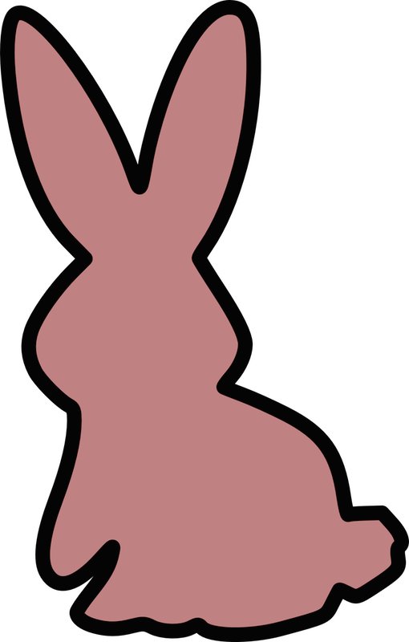
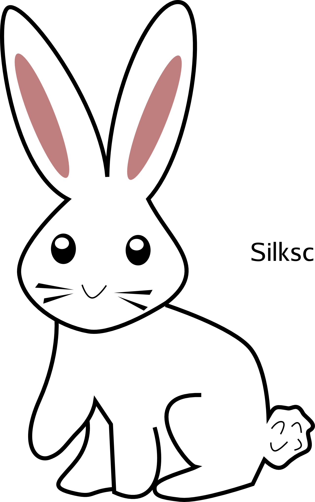
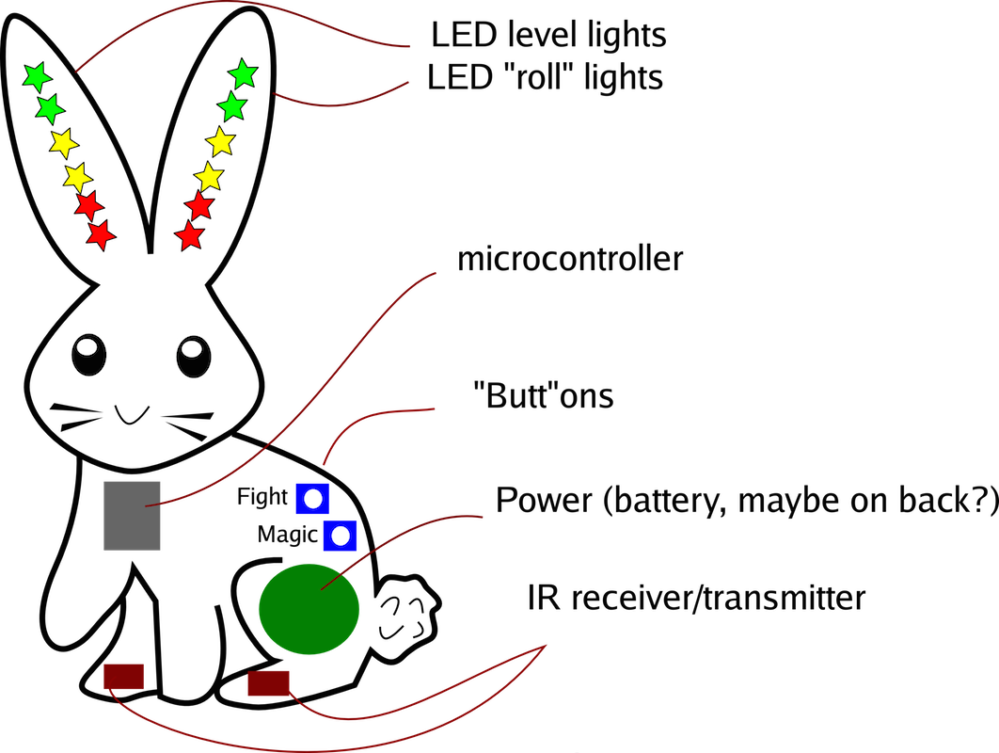

# Battle bunnies!

This is a goofy little side project that involves making a little electronic
bunny game in the name of learning a bit more about electronic badge design.

## How the game is played

Battle bunnies is meant to be a simple electronic game.  Each participant
gets their own bunny.  The bunnies have IR on one side of the PCB.
Participants line up their IR with the IR of another bunny and both hit the
"fight" button.  The bunnies each "roll" a random number 1-6 which is shown
on one ear and transmit that number to the other bunny.  The bunny with the
highest number gains a level.  In the case of a tie, both bunnies gain a
level (because why not?).  The levels are updated on the other ear.
Depending on how slow we want the level process to be, losing bunnies might
lose a level.

The "magic" button is an easter egg that can be activated when bunnies reach
max level.

## Bunny design

These are all early drafts which I'm sure we'll change.

### PCB outline

### Silkscreen bunny

### Explanation of what components go where

